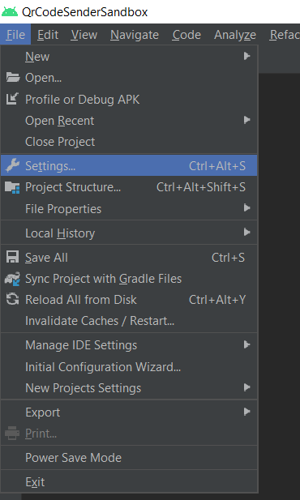
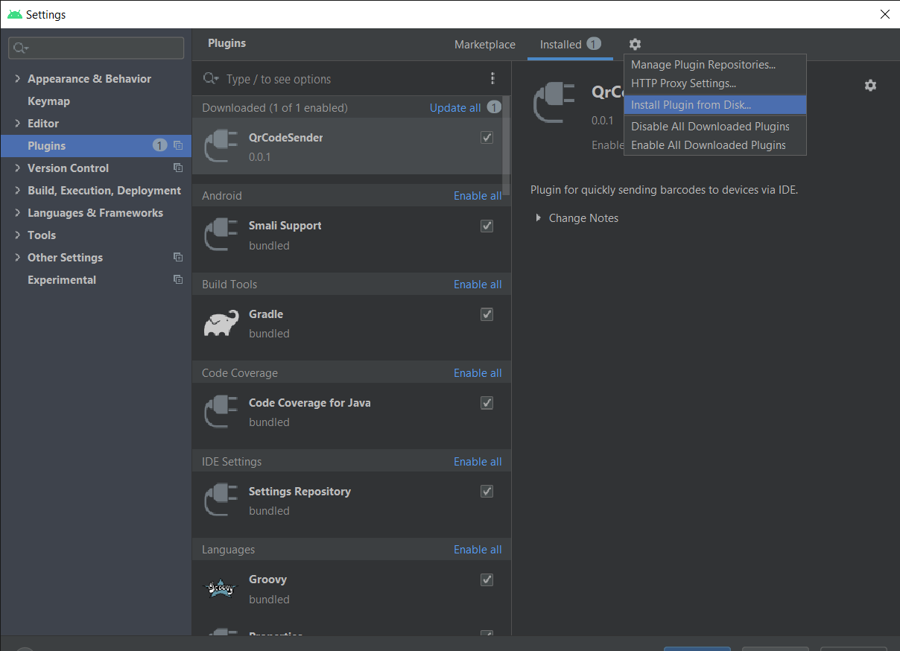
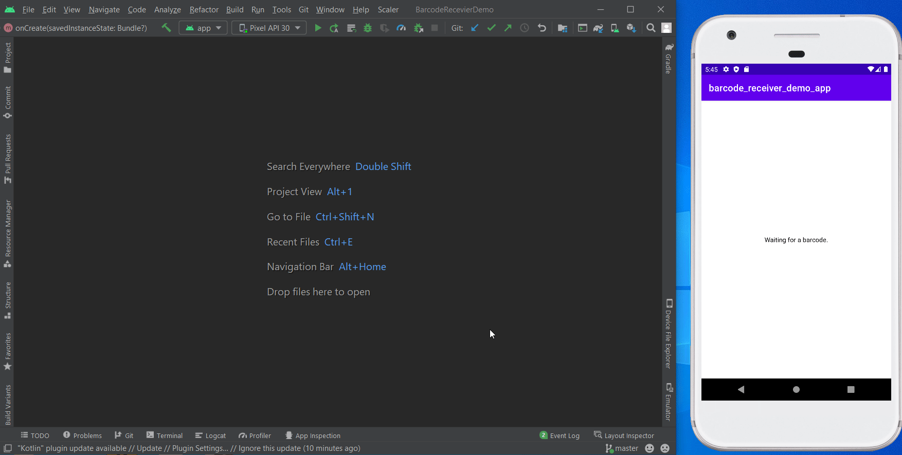
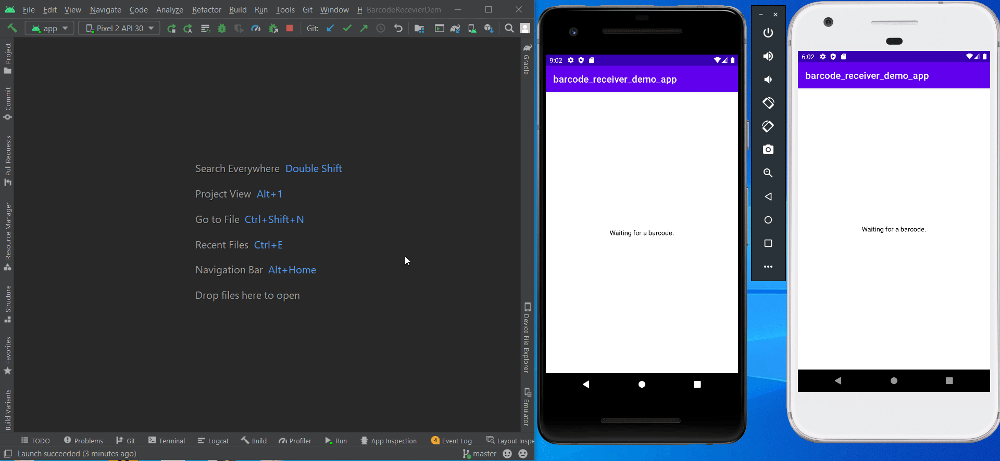
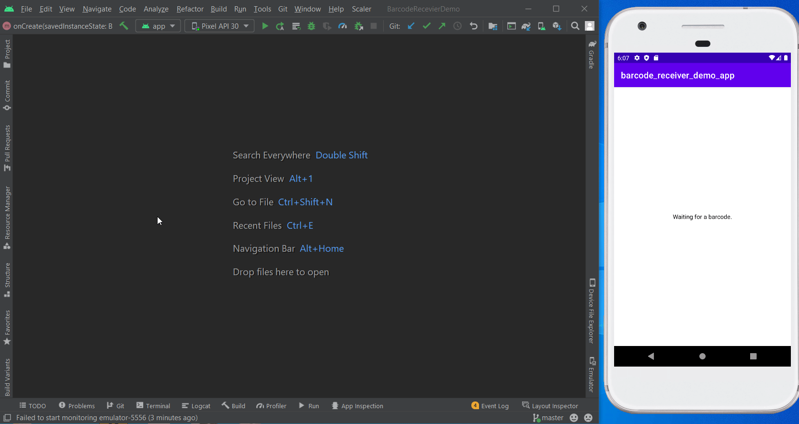
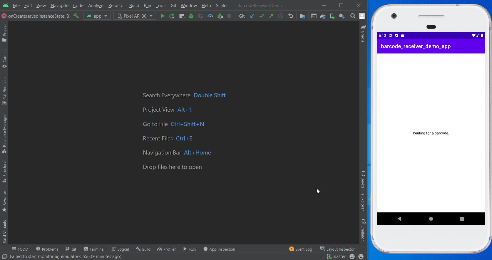
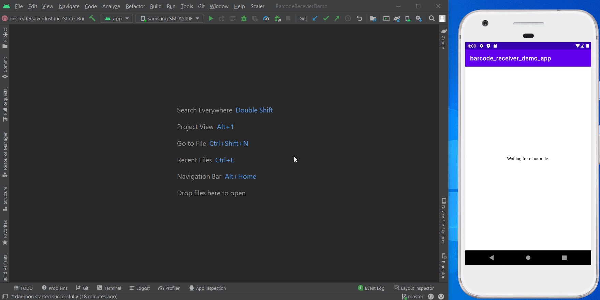

## Overview

### What is BarcodeSenderPlugin

A small plugin for Android Studio for sending barcodes to devices via IDE.

### Why BarcodeSenderPlugin was written.

The plugin is designed to simplify the developer's life. If your application has use cases when a user needs to scan a
barcode using a phone camera or scanner, then it is not necessary to provide a barcode using these tools when searching
for a bug, you can simply send it via IDE.

## Install

### Android studio requirements

Android studio supported from version `Android Studio Electric Eel (2022.1.1)`.

1. Download [latest release plugin](https://github.com/IosephKnecht/barcode-sender-plugin/releases/tag/v1.0.0-alpha01-221.6008.13)
2. Install plugin from disk (File -> Settings -> Plugins -> Settings -> Install from disk)
3. Set receiver key to settings for your app. (File -> Settings -> Tools -> Barcode Sender Settings Plugin)

|                    Settings                     |            Plugin install settings             |
|:-----------------------------------------------:|:----------------------------------------------:|
|  |  |

## Features

<details>
<summary>Sending barcodes to one device.</summary>



</details>
<details>
  <summary>Sending barcodes to multiple devices.</summary>



</details>
<details>
  <summary>Generation of barcodes (Supported types EAN8, EAN13, EAN13 + 2, EAN13 + 5, UPC-A and GTIN).</summary>



</details>
<details>
  <summary>Generation of multiple barcodes.</summary>



</details>

## Usage

1. In Android Studio use hot key `ctrl + alt + R` or double shift button click and search "BarcodeSenderAction".
2. Choice device receiver.
3. Enter barcode to text field.
4. Press "Send".



## How to connect your application to listen to barcodes from the plugin.

To connect application for listening to barcodes from the plugin, it is enough to register the broadcast receiver in
your main activity and, after receiving result, send received string for processing.

<details>
  <summary>Kotlin</summary>

```kotlin
class MainActivity : AppCompatActivity() {

    private val broadcastReceiver = object : BroadcastReceiver() {
        override fun onReceive(context: Context, intent: Intent?) {
            intent?.getStringExtra(BARCODE_EXTRA_STRING_KEY)?.let(this@MainActivity::handleBarcode)
        }
    }

    override fun onCreate(savedInstanceState: Bundle?) {
        super.onCreate(savedInstanceState)
        setContentView(R.layout.activity_main)

        object : DefaultLifecycleObserver {
            override fun onResume(owner: LifecycleOwner) {
                activity.registerReceiver(
                    broadcastReceiver,
                    IntentFilter(BARCODE_INTENT_FILTER_KEY)
                )
            }

            override fun onPause(owner: LifecycleOwner) {
                activity.unregisterReceiver(broadcastReceiver)
            }

            override fun onDestroy(owner: LifecycleOwner) {
                owner.lifecycle.removeObserver(this)
            }
        }
    }

    private fun handleBarcode() {
        // do something
    }

    private companion object {
        const val BARCODE_INTENT_FILTER_KEY = "YOUR_APP_RECEIVER_KEY"
        const val BARCODE_EXTRA_STRING_KEY = "EXTRA_STRING_BARCODE"
    }
}
```

</details>
<details>
  <summary>Java</summary>

```java
public class MainActivity extends AppCompatActivity {

    private static final String BARCODE_INTENT_FILTER_KEY = "YOUR_APP_RECEIVER_KEY";
    private static final String BARCODE_EXTRA_STRING_KEY = "EXTRA_STRING_BARCODE";

    private final BroadcastReceiver broadcastReceiver = new BroadcastReceiver() {
        @Override
        public void onReceive(Context context, Intent intent) {
            if (intent == null) return;
            String barcode = intent.getStringExtra(BARCODE_EXTRA_STRING_KEY);
            if (barcode == null) return;
            handleBarcode(barcode);
        }
    };

    @Override
    protected void onCreate(@Nullable Bundle savedInstanceState) {
        super.onCreate(savedInstanceState);
        setContentView(R.layout.activity_main);

        LifecycleObserver observer = new DefaultLifecycleObserver() {
            @Override
            public void onResume(@NonNull LifecycleOwner owner) {
                registerReceiver(broadcastReceiver, new IntentFilter(BARCODE_INTENT_FILTER_KEY));
            }

            @Override
            public void onPause(@NonNull LifecycleOwner owner) {
                unregisterReceiver(broadcastReceiver);
            }

            @Override
            public void onDestroy(@NonNull LifecycleOwner owner) {
                owner.getLifecycle().removeObserver(this);
            }
        };

        getLifecycle().addObserver(observer);
    }

    private void handleBarcode(@NonNull final String barcode) {
        // do something
    }
}
```

</details>

## Sample project

Sample project is a dummy application waiting to send a barcode and displaying it, you can find
it [here](https://github.com/IosephKnecht/barcode-receiver-demo-app).

[](https://www.buymeacoffee.com/iosephknecht)